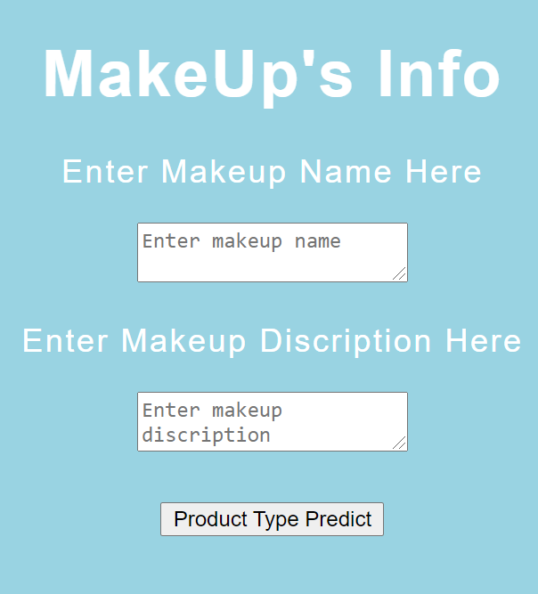
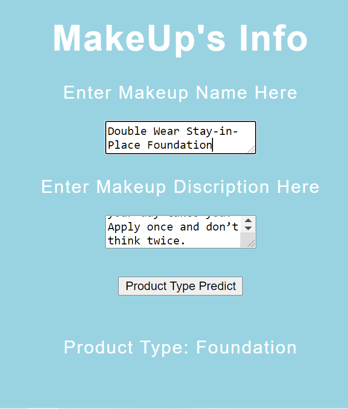

# Flask-app-with-Product-Type

This is a showcase of deploying a machine learning model to the web with Falsk on AWS EC2.

**File Structure of the Flask App:**  

```
├── static  
│   ├── css  
│   │   ├── style.css  
├── templates  
│   ├── index.html  
├── images  
│   ├── flask_1.png  
|   ├── flask_2.png  
├── pt-app.py  
├── functions.py  
├── product_type_vectorizer.sav  
└── product_type_finalized_model.sav  
├── README.md
├── steps.txt 
└── requirements.txt
```  

 **Project Structure**
 
 **1. Model Deserialization**  

These two file are serialized from the NLP process within [this repo](https://github.com/xxuanwang/NLP-Project-with-Beatuty-Porducts). Here we'll use these files after de-serialized the pickled models in the form of python object.  
    
  - `product_type_vectorizer.sav`
  - `product_type_finalized_model.sav`

 **2. Website template**  
  - static/`style.css`  
    - It contains the CSS styling of the main page.
 
  - templates/`index.html` 
    - It allows users enter the name and description of a makeup product, and show the prediction.  

<p align="center">

</p>

**3. Flask Back-End API**
  - `pt-app.py`
    - Clean the input makeup details (text) with `functions.py`;
    - Predict the product type based on above mentioned models;
    - Display the output result on the GUI.  

<p align="center">
 
</p>

**4. AWS EC2 Connection**
  - EC2 Instance

**Other files**  

  - `steps.txt`
    - It contains the commands to set up a virtual env, transfer files bwtween local machine and remote EC2 instance, the application url, and the test input of a makeup product.
 
  - `requirements.txt`
    - Includes all the required python libraries/packages to run this app.  

**References**:
- Deploy ML models on AWS  
1. [Deploying ML models To the Web with Flask on AWS EC2 Instance](https://medium.com/shapeai/deploying-flask-application-with-ml-models-on-aws-ec2-instance-3b9a1cec5e13)

2. [5 Different Ways to Deploy your Machine Learning Model with AWS](https://towardsdatascience.com/5-different-ways-to-deploy-your-machine-learning-model-with-aws-bd676ab5f8d4)  

- Deploy ML models locally
3. [Simple way to deploy machine learning models to cloud](https://towardsdatascience.com/simple-way-to-deploy-machine-learning-models-to-cloud-fd58b771fdcf)  
